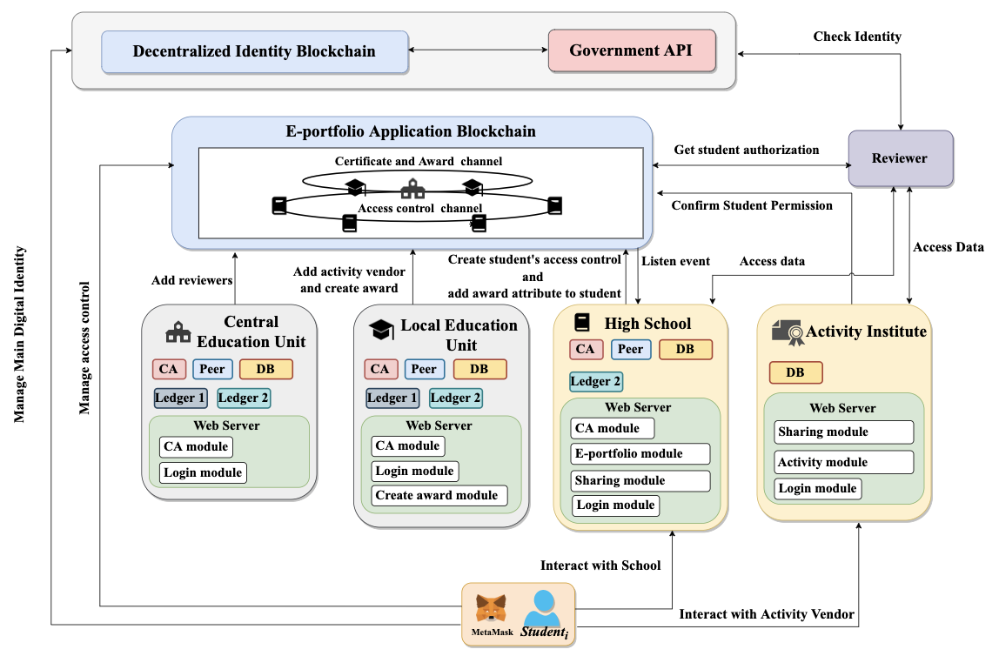

# Learing-Portfolio
In this thesis, we propose a self-sovereign identity based personal information security control infrastructure for the e-portfolio ecosystem. The decentralized identity chain and e- portfolio application chain are included in this system. The decentralized identity chain integrates the identities of users in different ecosystems and gives users a self-sovereign identity that can be fully controlled by themselves. The e-portfolio application chain records the authorization of the user. Besides, the trusted education unit audits the source of the review data together.

DID-chain provide users with a self-sovereign identity. Users can fully control their own identity no longer rely on centralized services. 
* login with digital signature 
* Integrate the identities of user in different ecosystem
* Auditable and traceable identity

E-portfolio app-chain provides users to authorize and share their own data for review, and trusted educational organizations audit the application of activity vendors to ensure the data source.


As shown in the following figure, the role relationship in e-portfolio ecosystem.  
<p align="center">
    
</p>

### Built With
* [Node v14.15.1](https://nodejs.org/en/)
* [Docker](https://www.docker.com/)

## Getting Started
Before getting started, you should build the [ethereum environment](https://github.com/trufflesuite/ganache) (e.g., ganache) and setup the [hyperledger fabric environment](https://github.com/hyperledger-labs/fablo).

### Ethereum network
(optional) Here is an example of using docker to create a ethereum test network.
```sh
    > docker run --detach --publish 8545:8545 trufflesuite/ganache-cli:latest --seed 0 --gasPrice 0
    cb1ce0da5c06202929175c151a0c7ce16e3306d808eb03211185b091cc00c475
    > docker logs cb1
    Available Accounts
    ==================
    (0) 0xe092b1fa25DF5786D151246E492Eed3d15EA4dAA (100 ETH) // DID-chain and Deploy smart contract
    (1) 0xc0d8F541Ab8B71F20c10261818F2F401e8194049 (100 ETH) 
    (2) 0xf1F8Ef6b4D4Ba31079E2263eC85c03fD5a0802bF (100 ETH)
    (3) 0xc91579bB7972f76D595f8665BffaF92874C8084C (100 ETH)
    (4) 0x6F03947036cba3279b07Cd6ea5Ca674cA51E52ba (100 ETH)
    (5) 0x889735777f51c84272a7FEb0d763280179A529a9 (100 ETH) // Data storge 
    (6) 0x2C46BcB6dA3ae85dA881edeEd4eC2fE92670f90F (100 ETH) // Education Ministry
    (7) 0x6a71E87487C0eC01EcFFd09a2042Cb5eD507393E (100 ETH) // Local Education Ministry
    (8) 0x3E014E5c311a7D6F652CA4F8bb016f4338A44118 (100 ETH) // high school
    (9) 0x75c4Fb2e81a6d3420125F5145182F528d1699146 (100 ETH) 

    Private Keys
    ==================
    (0) 0x0cc0c2de7e8c30525b4ca3b9e0b9703fb29569060d403261055481df7014f7fa
    (1) 0xb97de1848f97378ee439b37e776ffe11a2fff415b2f93dc240b2d16e9c184ba9
    (2) 0x42f3b9b31fcaaa03ca71cab7d194979d0d1bedf16f8f4e9414f0ed4df699dd10
    (3) 0x41219e3efe938f4b1b5bd68389705be763821460b940d5e2bd221f66f40028d3
    (4) 0x64530eda5f401cc2e9bba4e7b2e0ba9b1bb9d95c344bf8643776b57bb6eb9845
    (5) 0x76db32cb46895cdb4473c86b4468dbd45f46c1b3d7972002c72bea74efff18ef
    (6) 0x3b747127e9ea07790d0fe9b8e5b6508953740d6cf0269d3145cdf1b69c22f2bb
    (7) 0xc01836866febf10022ec9ae632677937f3070d4ed4819e5c6e03d3e8ec02dc2e
    (8) 0xdf207d299d941818bb4f7822cf003662370a7d685016dfc3f1e2cac03d47fc1d
    (9) 0x2d9d98ee99c8f7c664125ff2b3b91f356e880917b2d9fc508ffe1b647bd7a9fd
```
Import those key to metamask for testing.

### Deploy ethereun smart contract
(optional) If you don't have `truffle` toolkit, you also can compile your contract code by online IDE, e.g., [Remix](https://remix.ethereum.org/).

### Fabric network
* Fablo setup
copy [fablo-config.json](https://github.com/junyuwow/Learing-Portfolio/blob/main/config/fablo-config.json) and [chaincode](https://github.com/junyuwow/Learing-Portfolio/tree/main/contracts/chaincodes) to your fablo repository.
#### fablo folder structure
    .
    ├─ fablo repository
       ├── fablo-config.json
       ├── chaincodes                    
       │   ├── chaincode-accessControlManager-node   
       │   ├── chaincode-certManager-node                 
       │   │   └── index.js
       |   |   └── package.json
       │   │    
       |   └── chaincode-issueAward-node
       ├── fablo-target
       └── fablo
       
run test-network
```sh
    ./fablo up
```

### Installation
1. Clone the repo
    ```sh 
    git clone https://github.com/junyuwow/Learing-Portfolio.git
    ```
2. Install NPM packages
    ```sh
    npm install
    ```
3. Setup hyperledger fabric connection profiles 
    ```sh
    cp ./../fablo/fablo-target/fabric-config/connection-profiles/connection-profile-org1.json connection-org1.json
    cp ./../fablo/fablo-target/fabric-config/connection-profiles/connection-profile-org2.json connection-org2.json
    cp ./../fablo/fablo-target/fabric-config/connection-profiles/connection-profile-org3.json connection-org3.json
    ```
4. Launch Dapp.
    ```sh
    npm start
    ```
